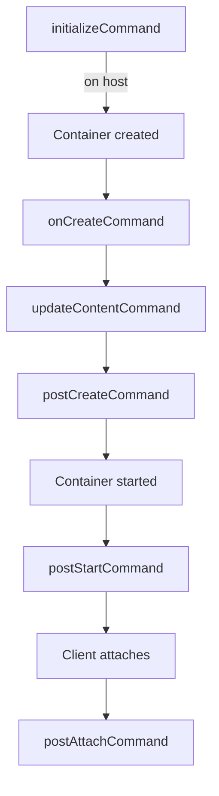

Lifecycle scripts let you automate setup and teardown tasks at well-defined points during a dev container's lifetime. Each hook maps to a field in `devcontainer.json`.

## Command syntax

Every lifecycle command accepts one of three forms:

<Tabs>
  <Tab title="String">
    A single shell command. The shell is determined by the container's default shell.

    ```json
    { "postCreateCommand": "npm install" }
    ```
  </Tab>
  <Tab title="Array">
    A command and its arguments as an array. No shell expansion is applied.

    ```json
    { "postCreateCommand": ["npm", "install", "--prefer-offline"] }
    ```
  </Tab>
  <Tab title="Object (parallel)">
    A map of named commands that run in parallel. Keys are labels; values are strings or arrays.

    ```json
    {
      "postStartCommand": {
        "server": "npm run dev",
        "db": "docker-compose up -d db"
      }
    }
    ```
  </Tab>
</Tabs>

## Hooks

The hooks run in the following order. Unless noted otherwise, they run inside the container as the `remoteUser`.



<AccordionGroup>
  <Accordion title="initializeCommand" defaultOpen={false}>
    **Runs on: host**

    Executes on the host machine before the container is created or started. Because the container does not exist yet, this hook cannot run container commands.

    Use it for host-side prerequisites: checking environment variables, authenticating to a registry, or preparing bind-mount directories.

    ```json
    {
      "initializeCommand": "echo 'Starting container setup'"
    }
    ```

    <Warning>
      `initializeCommand` runs on the host, not inside the container. Do not rely on container tooling here.
    </Warning>
  </Accordion>

  <Accordion title="onCreateCommand">
    **Runs on: container — once, on first creation**

    Executes inside the container the first time it is created. It does not run again when the container is restarted or rebuilt unless the container is deleted and recreated.

    Use it for one-time setup that is expensive to repeat, such as compiling native extensions or generating certificates.

    ```json
    {
      "onCreateCommand": "sudo apt-get install -y build-essential"
    }
    ```
  </Accordion>

  <Accordion title="updateContentCommand">
    **Runs on: container — on creation and when workspace content changes**

    Similar to `onCreateCommand`, but also re-runs whenever the workspace content is updated. This is intended for tools that rebuild indexes or caches when source files change.

    ```json
    {
      "updateContentCommand": "pip install -r requirements.txt"
    }
    ```

    <Note>
      When `--prebuild` is passed to `devcontainer up`, execution stops after `updateContentCommand`. This is useful for pre-building container images.
    </Note>
  </Accordion>

  <Accordion title="postCreateCommand">
    **Runs on: container — once, after first creation**

    The most commonly used hook. Runs once after the container is created and `updateContentCommand` has finished. Use it for dependency installation, code generation, or any other setup that should happen exactly once.

    ```json
    {
      "postCreateCommand": "npm install"
    }
    ```

    Multiple commands using parallel object syntax:

    ```json
    {
      "postCreateCommand": {
        "deps": "npm install",
        "hooks": "npx husky install"
      }
    }
    ```
  </Accordion>

  <Accordion title="postStartCommand">
    **Runs on: container — every time the container starts**

    Executes each time the container starts, including restarts. Use it for long-running background processes or tasks that must be re-initialized on each start.

    ```json
    {
      "postStartCommand": {
        "server": "npm run dev",
        "db": "docker-compose up -d db"
      }
    }
    ```
  </Accordion>

  <Accordion title="postAttachCommand">
    **Runs on: container — each time a client attaches**

    Executes each time a tool (such as an editor or terminal) attaches to the running container. Use it for per-session setup that depends on which client is connecting.

    ```json
    {
      "postAttachCommand": "zsh"
    }
    ```

    Pass `--skip-post-attach` to `devcontainer up` to suppress this hook.
  </Accordion>
</AccordionGroup>

## Controlling blocking with waitFor

By default, `devcontainer up` waits for `updateContentCommand` to complete before returning. The `waitFor` property lets you change which command blocks the return.

```json
{
  "waitFor": "postCreateCommand"
}
```

Accepted values match the `DevContainerConfigCommand` type:

| Value | Blocks until |
|---|---|
| `"initializeCommand"` | `initializeCommand` completes |
| `"onCreateCommand"` | `onCreateCommand` completes |
| `"updateContentCommand"` | `updateContentCommand` completes (default) |
| `"postCreateCommand"` | `postCreateCommand` completes |
| `"postStartCommand"` | `postStartCommand` completes |
| `"postAttachCommand"` | `postAttachCommand` completes |

Commands that run after the `waitFor` target execute in the background without blocking the caller.

## CLI flags

Two flags on `devcontainer up` modify lifecycle script behavior:

<AccordionGroup>
  <Accordion title="--skip-post-create">
    Skips all of the following and does not install dotfiles:

    - `onCreateCommand`
    - `updateContentCommand`
    - `postCreateCommand`
    - `postStartCommand`
    - `postAttachCommand`

    ```bash
    devcontainer up --workspace-folder . --skip-post-create
    ```

    Use this when you want to start a container quickly for inspection without running setup scripts.
  </Accordion>

  <Accordion title="--skip-non-blocking-commands">
    Stops after the command specified by `waitFor` (or `updateContentCommand` by default) without running the hooks that follow it.

    ```bash
    devcontainer up --workspace-folder . --skip-non-blocking-commands
    ```

    This is useful in CI when you only need the container to be ready up to a specific point in the lifecycle.
  </Accordion>
</AccordionGroup>

## Full example

```json devcontainer.json
{
  "name": "Full-stack App",
  "image": "mcr.microsoft.com/devcontainers/javascript-node:22",

  "initializeCommand": "docker network inspect devnet || docker network create devnet",

  "onCreateCommand": "sudo apt-get update && sudo apt-get install -y postgresql-client",

  "updateContentCommand": "npm ci",

  "postCreateCommand": {
    "db-migrate": "npm run db:migrate",
    "git-hooks": "npx husky install"
  },

  "postStartCommand": {
    "server": "npm run dev",
    "watch": "npm run build:watch"
  },

  "postAttachCommand": "echo 'Welcome to the dev container!'",

  "waitFor": "postCreateCommand"
}
```
